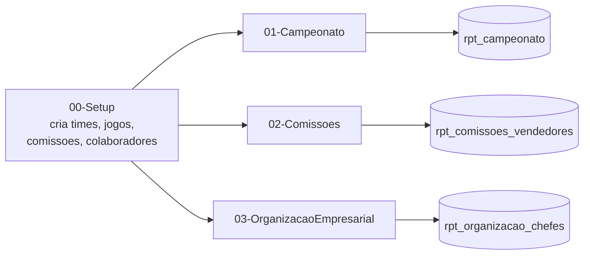
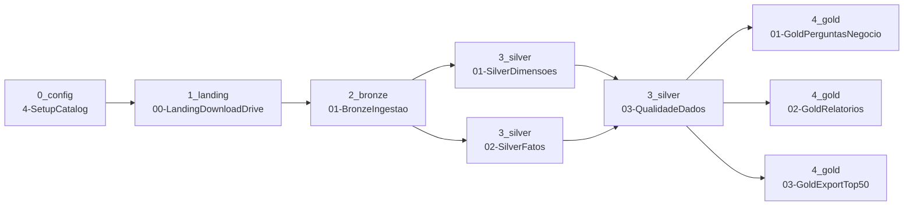
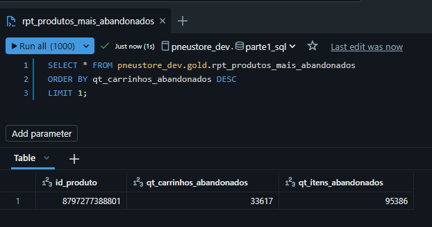
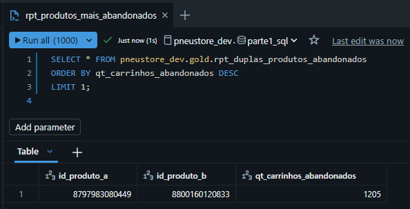
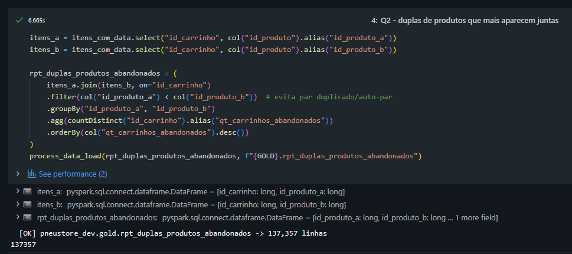
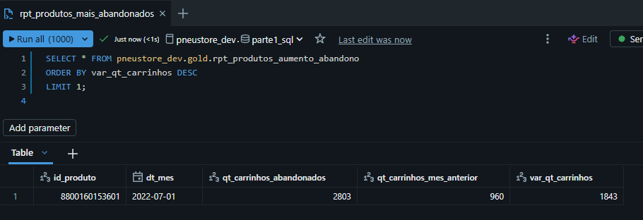
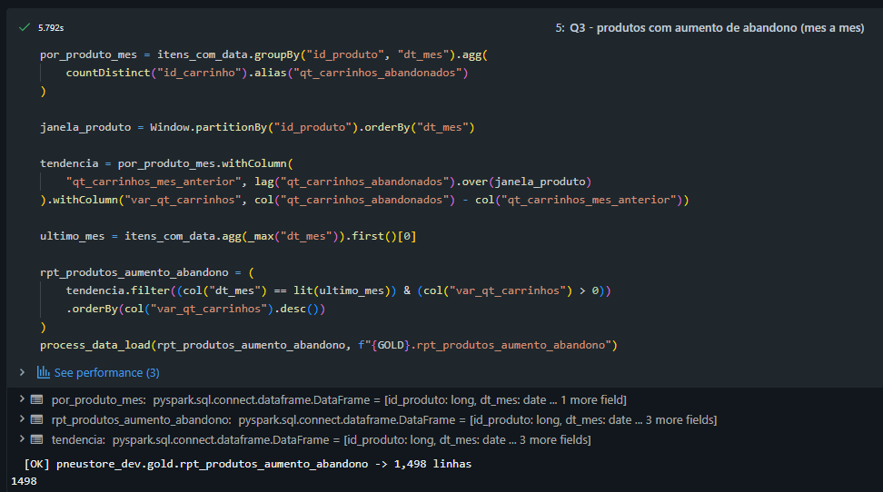
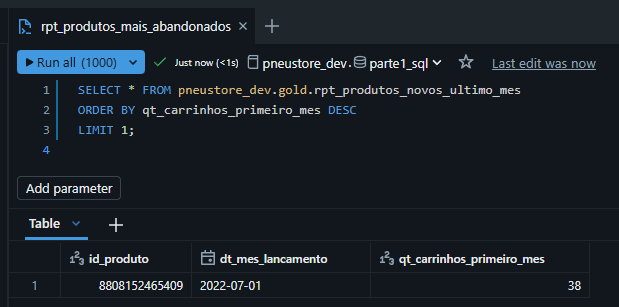

# Case — Engenheiro de Dados

Entrega de um teste técnico para vaga de Engenheiro de Dados, dividido em duas partes.
Enunciado completo em [case/CASO.md](case/CASO.md).

## Conteúdo

- `case/` — enunciado original (CASO.md), descrição da vaga (VAGA.md) e o export final (top50)
- `notebooks/parte1_sql/` — setup (tabelas de exemplo) + as 3 queries da Parte 1
- `notebooks/0_config/` — catalog, paths, mapeamento das fontes, funções compartilhadas
- `notebooks/1_landing/` — download do Google Drive
- `notebooks/2_bronze/` — ingestão bruta das 8 tabelas
- `notebooks/3_silver/` — tipagem e conformidade
- `notebooks/4_gold/` — perguntas de negócio, relatórios e export
- `databricks.yml` + `resources/jobs/` — Asset Bundle
- `img/` — prints de execução real, referenciados neste README

---

## Parte 1 — SQL

Roda como notebook + Job (`wf_pneustore_sql_parte1`), com o dado de exemplo do
próprio enunciado — não é só uma query solta, o setup cria as tabelas e popula
com os dados do PDF antes de cada query rodar. Ver [notebooks/parte1_sql/](notebooks/parte1_sql/).

| | |
|---|---|
|  | Job `wf_pneustore_sql_parte1` disparado — `setup` rodando, as 3 queries aguardando |
|  | Job concluído — `campeonato`, `comissoes` e `organizacao_empresarial` com sucesso |
|  | `00-Setup`: criação das 4 tabelas de exemplo (aqui, `colaboradores`) |

### 1.1 Campeonato

**Pergunta:** classificar as equipes por pontos (vitória=3, empate=1, derrota=0),
ordenado por pontos desc e, em empate, por `time_id` asc.

**Como foi calculado:** soma os pontos de cada time somando o resultado como
mandante e como visitante (`UNION ALL`), com `LEFT JOIN` a partir de `times` pra
time sem nenhuma partida entrar com 0 pontos. Query: [`01-Campeonato.py`](notebooks/parte1_sql/01-Campeonato.py).

**Resposta:**

| time_id | time_nome | num_pontos |
|---|---|---|
| 20 | Marketing | 4 |
| 50 | Dados | 4 |
| 10 | Financeiro | 3 |
| 30 | Logística | 3 |
| 40 | TI | 0 |

| Evidência (resultado real) | Log de gravação |
|---|---|
|  |  |

### 1.2 Comissões

**Pergunta:** listar vendedores que receberam pelo menos R$1024 somando até 3
das suas comissões (não precisa ser as 3 primeiras cronologicamente, e sim
qualquer subconjunto de até 3).

**Como foi calculado:** ranqueia as comissões de cada vendedor da maior pra
menor (`ROW_NUMBER`), pega só as 3 maiores de cada um e soma — se as 3 maiores
não chegam a 1024, nenhum subconjunto menor chegaria. Query: [`02-Comissoes.py`](notebooks/parte1_sql/02-Comissoes.py).

**Resposta:** `Lucas`, `Matheus` (Bruno fica de fora — recebeu R$1.200 em 4
vendas, mas nenhuma combinação de 3 chega a R$1.024, exatamente a pegadinha do enunciado).

| Evidência (resultado real) | Log de gravação |
|---|---|
|  |  |

### 1.3 Organização Empresarial

**Pergunta:** pra cada funcionário, achar o chefe indireto mais próximo na
hierarquia que ganha pelo menos o dobro do salário dele. `NULL` se ninguém na
cadeia cumprir a condição.

**Como foi calculado:** `WITH RECURSIVE` sobe a cadeia de chefes de cada
funcionário (chefe direto, chefe do chefe, etc.), marca como candidato todo
chefe da cadeia com salário ≥ 2× o do funcionário, e pega o mais próximo
(menor nível na subida) via `ROW_NUMBER`. Query: [`03-OrganizacaoEmpresarial.py`](notebooks/parte1_sql/03-OrganizacaoEmpresarial.py).

**Resposta:**

| id_funcionario | id_chefe |
|---|---|
| 10 | 20 |
| 20 | NULL |
| 30 | 10 |
| 40 | 50 |
| 50 | 20 |
| 60 | 10 |
| 70 | 10 |

| Evidência (resultado real) | Log de gravação |
|---|---|
|  |  |

---

## Parte 2 — Carrinho Abandonado

Dataset SAP Hybris/Commerce Cloud, ~33M linhas em 8 tabelas: carrinhos, itens,
usuários, endereços, formas de pagamento etc. O dado bruto é grande demais pra
caber no git, então fica hospedado numa pasta privada e é baixado em runtime.

Job: `wf_pneustore_carrinho_abandonado`. Landing, Bronze, Silver e Gold rodam
como notebooks orquestrados por esse Job (Databricks Asset Bundles), com upsert
por chave em Bronze/Silver — não é um overwrite cego, uma nova execução
atualiza só o que mudou. `QualidadeDados` bloqueia a Gold se alguma tabela
Silver falhar nos checks (linha zero, chave nula, chave duplicada).

| | |
|---|---|
|  | Job disparado — `setup` rodando |
|  | Job completo com sucesso — DAG inteiro, ~5min |
|  | Unity Catalog: as 7 tabelas Gold + o volume `exports` com o `.txt` do top50 |
|  | E-mail automático de sucesso do Job (`email_notifications.on_success`) |

Log de cada etapa do pipeline (código + contagem real de linhas gravadas):

| Etapa | Evidência |
|---|---|
| `landing_download` — 8 arquivos baixados do Drive |  |
| `bronze_ingestao` — 8 tabelas, ~16M linhas em `tb_carts` |  |
| `silver_dimensoes` — `dim_usuarios`, `dim_enderecos` etc. |  |
| `silver_fatos` — `fato_carrinhos`, `fato_carrinho_itens` |  |
| `qualidade_dados` — 8 tabelas verificadas, todas OK |  |

### Perguntas de negócio

Geradas por [`notebooks/4_gold/01-GoldPerguntasNegocio.py`](notebooks/4_gold/01-GoldPerguntasNegocio.py).
Cada resposta abaixo é o **#1 do ranking** — a tabela completa (todos os
produtos/duplas/meses/estados) fica gravada em `gold.rpt_*` e também aparece
nos prints de log.

#### Q1 — Quais os produtos que mais tiveram carrinhos abandonados?

**Como foi calculado:** conta, por produto, em quantos carrinhos distintos ele
apareceu; ordena decrescente.

**Resposta:** produto `8797277388801` — **33.617 carrinhos**, 95.386 itens abandonados.

| Evidência (`ORDER BY` explícito) | Log de gravação (5.505 produtos no total) |
|---|---|
|  |  |

#### Q2 — Quais as duplas de produtos em conjunto que mais tiveram carrinhos abandonados?

**Como foi calculado:** cruza os itens do mesmo carrinho consigo mesmo
(self-join por `id_carrinho`, filtro `produto_a < produto_b` pra não duplicar
o par nem parear produto com ele mesmo) e conta em quantos carrinhos cada
dupla aparece junta.

**Resposta:** produtos `8797983080449` + `8800160120833` — **1.205 carrinhos** com os dois juntos.

| Evidência (`ORDER BY` explícito) | Log de gravação (137.357 duplas no total) |
|---|---|
|  |  |

#### Q3 — Quais produtos tiveram um aumento de abandono?

**Como foi calculado:** agrupa por produto e mês, compara com o mês anterior
via `LAG` (window function particionada por produto), mantém só quem cresceu
no último mês disponível, ordena pela maior alta.

**Resposta:** produto `8800160153601` em jul/2022 — de **960 para 2.803 carrinhos (+1.843)**.

| Evidência (`ORDER BY` explícito) | Log de gravação (1.498 produtos com alta no total) |
|---|---|
|  |  |

#### Q4 — Quais os produtos novos e a quantidade de carrinhos no seu primeiro mês de lançamento?

**Como foi calculado:** acha o primeiro mês em que cada produto aparece no
dataset (não existe data de cadastro de catálogo nos dados fornecidos); filtra
só quem "estreou" no último mês disponível; conta carrinhos desse mês.

**Resposta:** produto `8808152465409`, lançado jul/2022 — **38 carrinhos** no mês de estreia.

| Evidência (`ORDER BY` explícito) | Log de gravação (108 produtos novos no total) |
|---|---|
|  |  |

#### Q5 — Quais estados tiveram mais abandonos?

**Problema real encontrado:** o campo de endereço de pagamento (`id_endereco`)
só é preenchido em **6 de 16 milhões de carrinhos** — quase ninguém chega
nessa etapa do checkout antes de abandonar. Usar só esse campo tornaria a
pergunta praticamente sem resposta.

**Como foi calculado (correção aplicada):** o carrinho grava
`p_zipcodecalculatedelivery`, o CEP usado pra simular o frete — preenchido bem
mais cedo no funil (ainda assim, precisou de limpeza: chega como
`"60440145.0"`, sufixo de double, ou `"nan"` quando vazio). Com o CEP limpo,
resolve a UF via faixa oficial de CEP dos Correios — o endereço de pagamento
tem prioridade quando existe (mais preciso), o CEP calculado cobre o resto.
Resultado: cobertura sobe de 0,00004% pra **~11,5%** dos carrinhos.

**Resposta:** **SP — 469.159 carrinhos**, o estado com mais abandonos (dos
1,84M carrinhos com UF identificada; 14,2M carrinhos continuam sem UF
identificável, por nunca terem chegado nem no CEP de frete).

| Ranking completo (28 linhas: 27 UFs + "sem UF") |
|---|
| SP 469.159 · MG 289.434 · RJ 144.788 · PR 113.874 · RS 113.219 · BA 107.366 · SC 91.599 · GO 84.643 · ES 64.410 · PE 56.035 · CE 47.317 · DF 42.781 · MT 27.260 · RN 27.258 · PB 27.148 · MS 20.308 · MA 19.561 · AL 18.580 · SE 15.955 · PA 15.745 · PI 15.545 · TO 15.326 · RO 2.958 · AM 1.182 · AC 734 · AP 571 · RR 355 |

### Relatórios de acompanhamento

Gerados por [`notebooks/4_gold/02-GoldRelatorios.py`](notebooks/4_gold/02-GoldRelatorios.py):
quantidade de carrinhos abandonados, quantidade de itens abandonados e valor
não faturado.

**Relatório produto × mês** (`gold.rpt_mensal_produto`, 55.409 linhas — uma por
produto/mês): maior valor não faturado num único mês foi o produto
`8797277388801` em nov/2021 — **R$ 35.093.414,88** não faturados, 7.792
carrinhos, 22.647 itens.

**Relatório diário** (`gold.rpt_diario`, 930 linhas — uma por data): dia de
maior valor não faturado foi **26/11/2021** — **R$ 149.001.667,56**, 166.954
carrinhos abandonados, 73.819 itens.

### Export top 50

Gerado por [`notebooks/4_gold/03-GoldExportTop50.py`](notebooks/4_gold/03-GoldExportTop50.py):
os 50 carrinhos de maior `carts.p_totalprice`, no layout hierárquico pipe-delimited
pedido na prova (1 linha de cabeçalho do carrinho + N linhas de item, sem `|`
final no cabeçalho e com `|` final em cada item). Arquivo real gerado:
[`case/top50_carrinhos_abandonados.txt`](case/top50_carrinhos_abandonados.txt)
(50 carrinhos, 217 linhas).

| Evidência de gravação |
|---|
|  |
