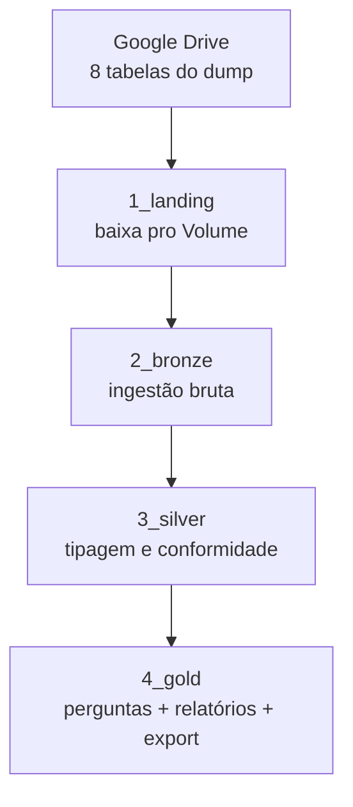

# Case — Engenheiro de Dados

Entrega de um teste técnico para vaga de Engenheiro de Dados, dividido em duas partes.

A primeira é SQL: um ranking de campeonato por pontos, uma consulta sobre comissões
de vendedores (soma de subconjuntos de transferências) e uma consulta recursiva de
hierarquia de funcionários (achar o chefe indireto mais próximo que ganha pelo menos
o dobro do salário). Respostas em [sql/](sql/).

A segunda parte é uma análise de carrinho abandonado num e-commerce (dataset SAP
Hybris/Commerce Cloud, ~33M linhas em 8 tabelas: carrinhos, itens, usuários,
endereços, formas de pagamento etc.). O dado bruto é grande demais pra caber no
git, então fica hospedado numa pasta do Google Drive e é baixado em runtime.

## Arquitetura

Landing, Bronze, Silver e Gold rodam como notebooks Databricks orquestrados por um
Job (Databricks Asset Bundles), com upsert por chave em Bronze/Silver — não é um
overwrite cego, uma nova execução atualiza só o que mudou.

<!-- imagem: DAG do Job rodando no Databricks -->

## Casos de uso (Parte 2)

Cada pergunta da prova vira uma tabela Gold, gerada por
[`notebooks/4_gold/01-GoldPerguntasNegocio.py`](notebooks/4_gold/01-GoldPerguntasNegocio.py):

| Pergunta | Tabela |
|---|---|
| Produtos com mais carrinhos abandonados | `gold.rpt_produtos_mais_abandonados` |
| Duplas de produtos que mais aparecem juntas | `gold.rpt_duplas_produtos_abandonados` |
| Produtos com aumento de abandono mês a mês | `gold.rpt_produtos_aumento_abandono` |
| Produtos novos e volume no primeiro mês | `gold.rpt_produtos_novos_ultimo_mes` |
| Estados com mais abandonos | `gold.rpt_estados_mais_abandonos` |

Os dois relatórios de acompanhamento (produto × mês e por data — quantidade de
carrinhos, itens e valor não faturado) saem de
[`notebooks/4_gold/02-GoldRelatorios.py`](notebooks/4_gold/02-GoldRelatorios.py).

O export final — `.txt` com os 50 carrinhos de maior valor, no layout pipe-delimited
pedido na prova — sai de
[`notebooks/4_gold/03-GoldExportTop50.py`](notebooks/4_gold/03-GoldExportTop50.py).

<!-- imagem: tabelas Gold no Unity Catalog -->

<!-- imagem: conteúdo do export top50_carrinhos_abandonados.txt -->

## Conteúdo

- `case/` — enunciado original (CASO.md) e descrição da vaga (VAGA.md)
- `sql/` — respostas da Parte 1
- `notebooks/0_config/` — catalog, paths, mapeamento das fontes, funções compartilhadas
- `notebooks/1_landing/` — download do Google Drive
- `notebooks/2_bronze/` — ingestão bruta das 8 tabelas
- `notebooks/3_silver/` — tipagem e conformidade
- `notebooks/4_gold/` — perguntas de negócio, relatórios e export
- `databricks.yml` + `resources/jobs/` — Asset Bundle
