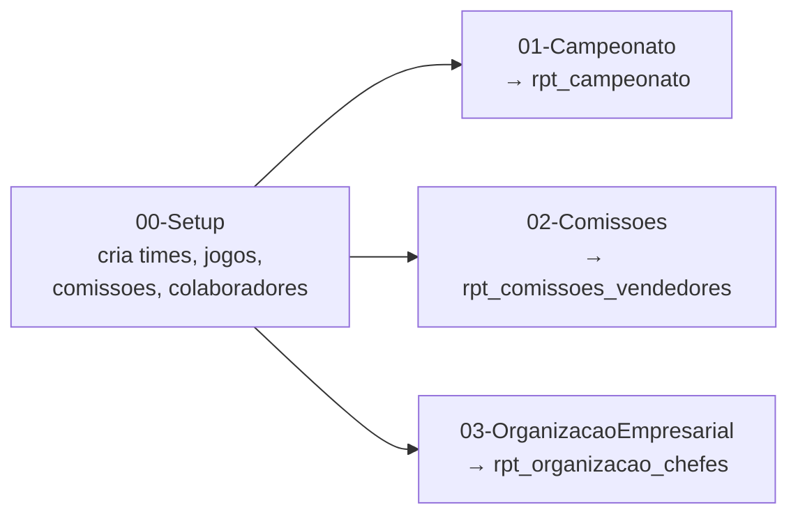
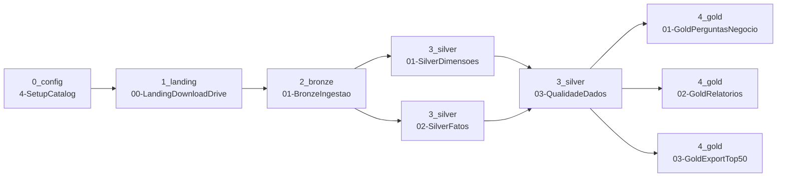

# Case — Engenheiro de Dados

Entrega de um teste técnico para vaga de Engenheiro de Dados, dividido em duas partes.

A primeira é SQL: um ranking de campeonato por pontos, uma consulta sobre comissões
de vendedores (soma de subconjuntos de transferências) e uma consulta recursiva de
hierarquia de funcionários (achar o chefe indireto mais próximo que ganha pelo menos
o dobro do salário). Roda como notebook + Job (`wf_pneustore_sql_parte1`), com o
dado de exemplo do próprio enunciado — ver [notebooks/parte1_sql/](notebooks/parte1_sql/):

- [`00-Setup.py`](notebooks/parte1_sql/00-Setup.py) — cria as 4 tabelas de exemplo do enunciado (`times`, `jogos`, `comissoes`, `colaboradores`)
- [`01-Campeonato.py`](notebooks/parte1_sql/01-Campeonato.py) — ranking por pontos → `rpt_campeonato`
- [`02-Comissoes.py`](notebooks/parte1_sql/02-Comissoes.py) — vendedores com até 3 comissões somando 1024+ → `rpt_comissoes_vendedores`
- [`03-OrganizacaoEmpresarial.py`](notebooks/parte1_sql/03-OrganizacaoEmpresarial.py) — chefe indireto mais próximo que ganha o dobro → `rpt_organizacao_chefes`

Job: `wf_pneustore_sql_parte1`.

A segunda parte é uma análise de carrinho abandonado num e-commerce (dataset SAP
Hybris/Commerce Cloud, ~33M linhas em 8 tabelas: carrinhos, itens, usuários,
endereços, formas de pagamento etc.). O dado bruto é grande demais pra caber no
git, então fica hospedado numa pasta do Google Drive e é baixado em runtime.

## Arquitetura

Job: `wf_pneustore_carrinho_abandonado`. Landing, Bronze, Silver e Gold rodam como
notebooks Databricks orquestrados por esse Job (Databricks Asset Bundles), com
upsert por chave em Bronze/Silver — não é um overwrite cego, uma nova execução
atualiza só o que mudou. `QualidadeDados` bloqueia a Gold se alguma tabela Silver
falhar nos checks (linha zero, chave nula, chave duplicada).

- [`notebooks/1_landing/`](notebooks/1_landing/) — baixa as 8 tabelas do dump do Google Drive pro Volume
- [`notebooks/2_bronze/`](notebooks/2_bronze/) — ingestão bruta, schema preservado como veio da fonte
- [`notebooks/3_silver/`](notebooks/3_silver/) — tipagem, conformidade e enriquecimento (ex.: resolução
  de UF do carrinho via faixa de CEP, já que o endereço de pagamento raramente é preenchido)
- [`notebooks/4_gold/`](notebooks/4_gold/) — as 5 perguntas de negócio, os 2 relatórios de acompanhamento e o export top50

<!-- imagem: DAG do Job rodando no Databricks -->

## Casos de uso (Parte 2)

Cada pergunta da prova vira uma tabela Gold, gerada por
[`notebooks/4_gold/01-GoldPerguntasNegocio.py`](notebooks/4_gold/01-GoldPerguntasNegocio.py):

| Pergunta | Tabela |
|---|---|
| Produtos com mais carrinhos abandonados | `gold.rpt_produtos_mais_abandonados` |
| Duplas de produtos que mais aparecem juntas | `gold.rpt_duplas_produtos_abandonados` |
| Produtos com aumento de abandono mês a mês | `gold.rpt_produtos_aumento_abandono` |
| Produtos novos e volume no primeiro mês | `gold.rpt_produtos_novos_ultimo_mes` |
| Estados com mais abandonos | `gold.rpt_estados_mais_abandonos` |

Os dois relatórios de acompanhamento (produto × mês e por data — quantidade de
carrinhos, itens e valor não faturado) saem de
[`notebooks/4_gold/02-GoldRelatorios.py`](notebooks/4_gold/02-GoldRelatorios.py).

O export final — `.txt` com os 50 carrinhos de maior valor, no layout pipe-delimited
pedido na prova — sai de
[`notebooks/4_gold/03-GoldExportTop50.py`](notebooks/4_gold/03-GoldExportTop50.py).

<!-- imagem: tabelas Gold no Unity Catalog -->

<!-- imagem: conteúdo do export top50_carrinhos_abandonados.txt -->

## Conteúdo

- `case/` — enunciado original (CASO.md) e descrição da vaga (VAGA.md)
- `notebooks/parte1_sql/` — setup (tabelas de exemplo) + as 3 queries da Parte 1
- `notebooks/0_config/` — catalog, paths, mapeamento das fontes, funções compartilhadas
- `notebooks/1_landing/` — download do Google Drive
- `notebooks/2_bronze/` — ingestão bruta das 8 tabelas
- `notebooks/3_silver/` — tipagem e conformidade
- `notebooks/4_gold/` — perguntas de negócio, relatórios e export
- `databricks.yml` + `resources/jobs/` — Asset Bundle
